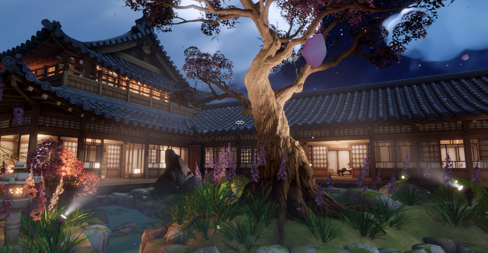
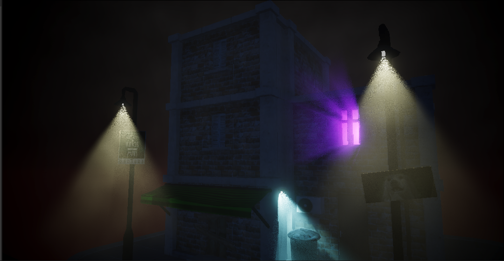
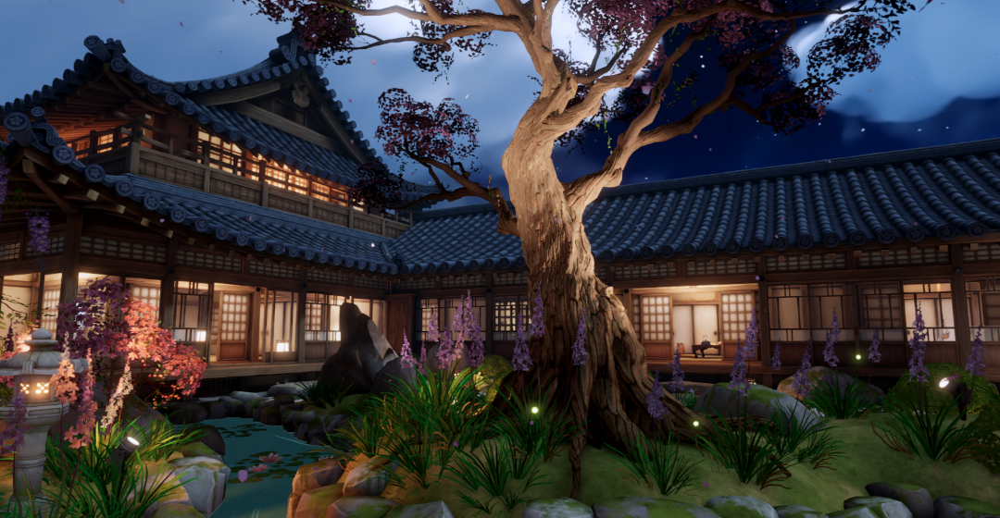
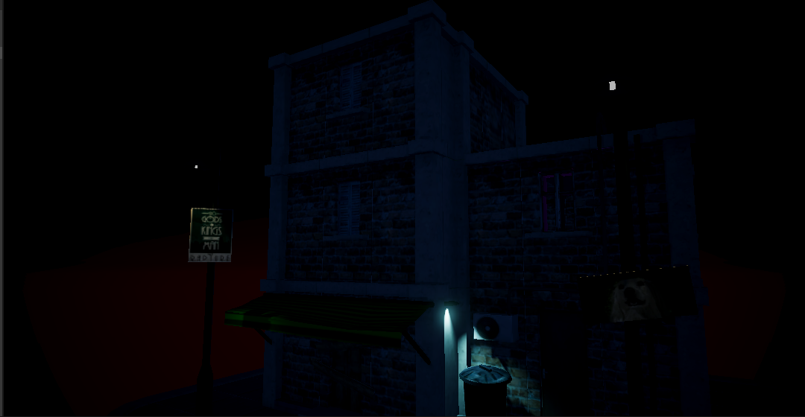
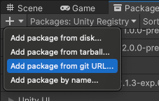
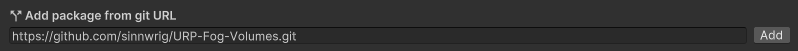
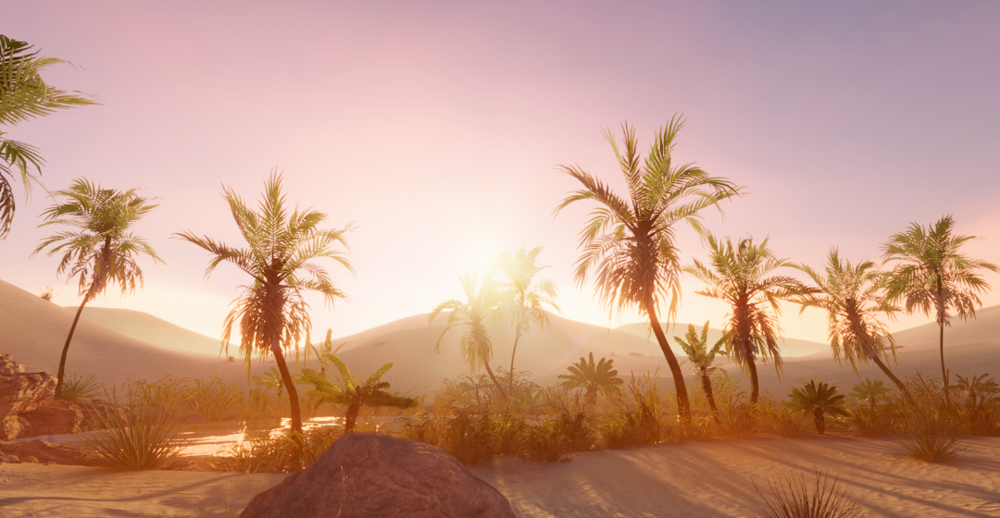
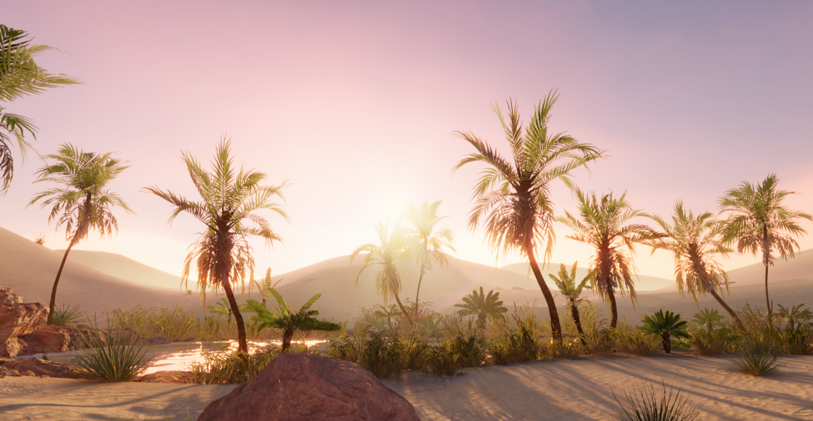
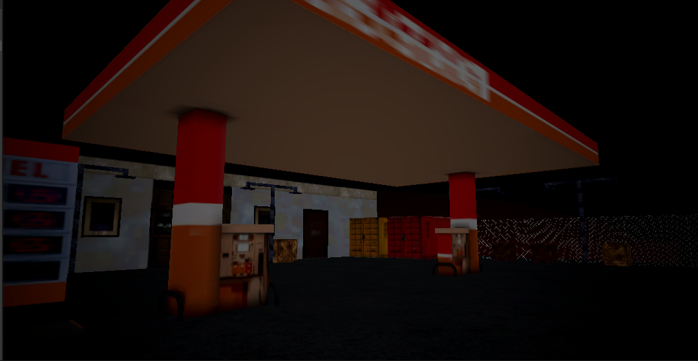
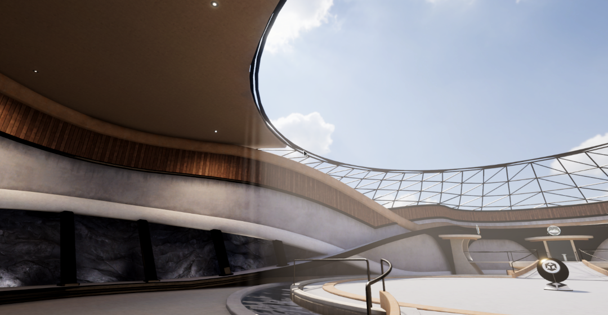

# Raymarched Fog Volumes for Unity's Universal RP

This repository is an implementation of single-bounce raymarched volumetric fog for Unity's Universal Render Pipeline. 

Scenes | Outdoors Light Shafts | URP Samples- Japanese Garden | Nighttime streetlights
:-:|:-:|:-:|:-:|
Fog |  |  | 
No Fog |   |   |  

[More Examples](#examples)

## Installation

* Open the package manager and select the _Add package from Git URL_ option found under the top left dropdown. 
 
* Add this repository git URL in the prompt, using the following link: https://github.com/sinnwrig/URP-Fog-Volumes.git. 
 

## Features

* Half & quarter-resolution rendering with depth-aware upsampling (Incompatible with temporal rendering).
* Temporal Rendering with reprojection (Semi-complete).
* Animated scrolling 3D texture noise
* 4 primitive shapes that support non-uniform scale and rotation:
    * Cube
    * Capsule
    * Sphere
    * Cylinder
* Support for all realtime lights, shadows, and cookies up to a maximum of 32 lights per volume. 
    * _Lighting is not entirely physically-based, and instead exposes artistic controls for finer tweaking._ 
    * _Light attenuation is only single-bounce, and fog does not self-shadow. Multiple-bounce lightmarching will be added soon._ 
* Support for APV GI in Unity 2023.1+
* Samples for the [_Gas Station_](#gas-station-with-and-without-fog),  [_Forest_](#japanese-forest-with-and-without-fog), and [_Office Building_](#building-with-and-without-fog) scenes. These can be imported through the package manager.

## Usage

* Add the Fog Volume Render Feature to your renderers.
* Create a new Fog Volume in the scene by adding the FogVolume component to any object or using the options under GameObject/Volumes/
* Create or assign a new profile.
* Adjust object scale and profile settings until you get your desired look.

## Limitations

#### Unresolvable
* Does not support DirectX 9 (Desktop GPUs before 2009~2011) or DirectX 11 9.x (DirectX version specifically for Windows Phone and Microsoft Surface RT). These shader models are incompatible with dynamic loops.
* Temporal Reprojection is disabled in scene view, and only works when in play mode. Unity does not seem to generate consistent motion vectors for the editor view, and causes severe warping/blurring.
* Temporal Reprojection cannot reproject parts where fog is facing the skybox or empty space. Motion vectors can't be created where there are no discernible features to track and compute movement.
* There is currently a hard cap of 32 lights per volume. This cap can be changed by editing the maximum light constants in [VolumetricFog.shader](https://github.com/sinnwrig/URP-Fog-Volumes/blob/main/Shaders/VolumetricFog.shader#L57) and [FogVolume.cs](https://github.com/sinnwrig/URP-Fog-Volumes/blob/main/Runtime/FogVolume.cs#L120)

#### Under Development
* Does not use physically based light scattering through the volume, as lighting is single-bounce only. This means that for directional lights, volumes will be evenly lit regardless of density. Lightmarching is planned on being added.
* Orthographic cameras do not work. This is planned on being fixed.
* Baked lighting and light probes does not work at the moment. This is planned on being fixed.

#### Transparency Handling
Due to how transparent objects are rendered to the depth texture, transparency does not work out-of-the-box with Fog Volumes and requires some additional render feature setup detailed in this [Forum Post](https://forum.unity.com/threads/transparent-shader-problem.1059206/), although a brief tutorial will be provided:
1. Put all the transparent renderers you want affected by fog into their own seperate layer (i.e 'TransparentDepth).
2. Remove the layer created just now from the _Transparent Layer Mask_ field in the _Filtering_ section of your active URP renderers. These objects will instead be rendered using the render feature.
3. Add the Render Objects render feature to your renderers **before** the Fog Volume render reature.
4. Set the _Event_ field of Render Objects to _AfterRenderingTransparents_
5. Under _Filters_, set the queue to _Transparent_ and the layer mask to our custom transparent depth layer.
6. Under _Overrides_, override _Depth_ and enable _Write Depth_ and set the _Depth Test_ to _Less Equal_

## Potential Issues

I am confident the the asset in its current state has no glaring or overly apparent issues. 
That said, this asset is not backed by heavy testing, and there is a chance that this package may have bugs or not work on some platforms. 

This asset has been tested on:
* OpenGL 4.5.
* DirectX 11.
* DirectX 12.
* Vulkan.
* Unity version 2022.3.
* Windows.
* Linux.

This asset has _not_ been tested, but may work on:
* Metal.
* VR or AR platforms.
* Versions of Unity below 2022.3.
* macOS. 
* PlayStation devices.
* Xbox devices.
* Nintendo devices.
* iOS.
* visionOS.
* Android.
* WebGL.
* UWP.
* tvOS.

# Examples
### Japanese Forest with and without fog

 
### Oasis with and without fog

 
### Building with and without fog

 
### Japanese Garden with and without fog

 
### Gas station with and without fog

 
### Demo Terminal Building with fog
 
