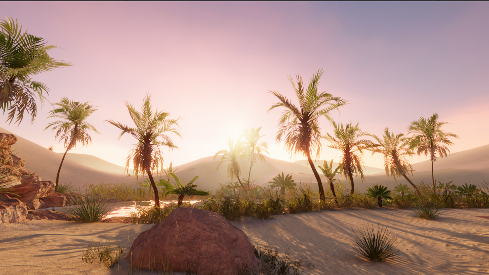

# Raymarched Fog Volumes for Unity's Universal RP

Implementation of Raymarched Volumetric Fog in Unity's Universal Render Pipeline

### Installation

* Open the package manager and select the _Add package from Git URL_ option found under the top left dropdown. 
 
* Add this repository git URL in the prompt, using the following link: https://github.com/sinnwrig/URP-Fog-Volumes.git. 
 

### Features

* Fog Volume Render Feature.
* Fog Volume Profile ScriptableObject.
* Fog Volume Behaviour.

### Usage

* Add the Fog Volume Render Feature to the current active renderer.
* Create a new Fog Volume in the scene by adding the FogVolume component to any object.
* Assign a new profile.
* Play with the scale and settings until your fog looks right.

### Potential issues/Requirements

This asset is not backed by heavy testing, and there is a good chance that some featues are incomplete or buggy. However, I am confident of its current state, and that there are no glaring or apparent bugs. 

* Not tested with VR/AR.
* Tested on Linux and Windows machines with Unity 2022. Mac, Mobile, and other platforms are untested.
* Orthographic cameras do not work.

### Limitations

* Does not support 
* Temporal Reprojection does not work in the scene view as motion vectors do not get generated. As such, ghosting is visible when moving the scene camera quickly around fog.
* There is currently a hard cap of 32 lights per volume. 
* Does not use physically based light scattering throughout the volume.
* Temporal Reprojection cannot properly reproject skybox or parts where fog is facing towards direct sky. There is a possible fix involving generating motion vectors for the fog bounding shape, but I'm not too keen on implementing it. 

### Example Scenes
* Japanese Forest with/without fog

 
* Oasis with/without fog

 
* Building with/without fog

 
* Japanese Garden with/without fog

 
* Gas station with/without fog

 
* Demo Terminal Building with fog
 
