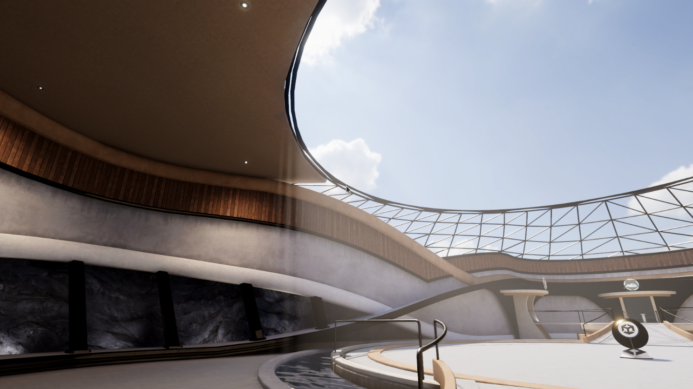

# Raymarched Fog Volumes for Unity's Universal RP

Implementation of Raymarched Volumetric Fog in Unity's Universal Render Pipeline

### Installation

* Open the package manager and select the _Add package from Git URL_ option found under the top left dropdown. 
 
* Add this repository git URL in the prompt, using the following link: https://github.com/sinnwrig/URP-Fog-Volumes.git. 
 

### Features

* Fog Volume Render Feature.
* Fog Volume Profile ScriptableObject.
* Fog Volume Behaviour.

### Usage

* Add the Fog Volume Render Feature to the current active renderer.
* Create a new Fog Volume in the scene by adding the FogVolume component to any object.
* Assign a new profile.
* Play with the scale and settings until your fog looks right.

### Potential Issues

I am confident the the asset in its current state has no glaring or overly apparent issues. 
That said, this asset is not backed by heavy testing, and there is a good chance that this package may have bugs or not work on some platforms. 

This asset has been tested on:
* OpenGL 4.5.
* Direct3D 11.
* Vulkan.
* Unity version 2022.3.
* A Linux machine.
* A Windows machine.

This asset has _not_ been tested on:
* Metal.
* Direct3D 12.
* VR or AR platforms.
* Versions of Unity besides 2022.3.
* macOS.
* PlayStation devices.
* Xbox devices.
* Nintendo devices.
* iOS.
* visionOS.
* Android.
* WebGL.
* UWP.
* tvOS.

### Limitations

* Does not support Direct3D 9 (Desktop GPUs before 2009~2011) or Direct3D 11 9.x (Windows Phone and Microsoft Surface RT).
* Temporal Reprojection does not work in scene view, and only works when in play mode.
* Temporal Reprojection cannot reproject parts where fog is facing the skybox or empty space. This is planned on being fixed. 
* There is currently a hard cap of 32 lights per volume. 
* Does not use physically based light scattering throughout the volume.
* Orthographic cameras do not work.

### Example Scenes
* Japanese Forest with/without fog

 
* Oasis with/without fog

 
* Building with/without fog

 
* Japanese Garden with/without fog

 
* Gas station with/without fog

 
* Demo Terminal Building with fog
 
